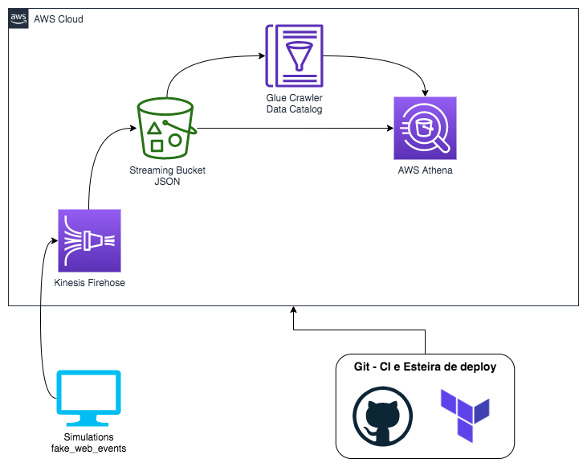

# igti-edc-mod1
Repositório para os exercícios do Módulo 1 do Bootcamp de Engenharia de Dados do IGTI

## Fundamentos de Arquitetura de Dados em Nuvem

#### Prof. Dr. Neylson Crepalde

Repositório com códigos e esteiras de deploy para as atividades do módulo 1 do bootcamp **Engenheiro de Dados Cloud** do IGTI. 

# Use Cases a serem trabalhos

## 1 - Delta Lake com EMR

Arquitetura da solução:

## 2 - Streaming de eventos com Kinesis

Arquitetura da solução:

## 3 - Orquestração de Pipelines de Big Data com Airflow

Arquitetura da solução:

